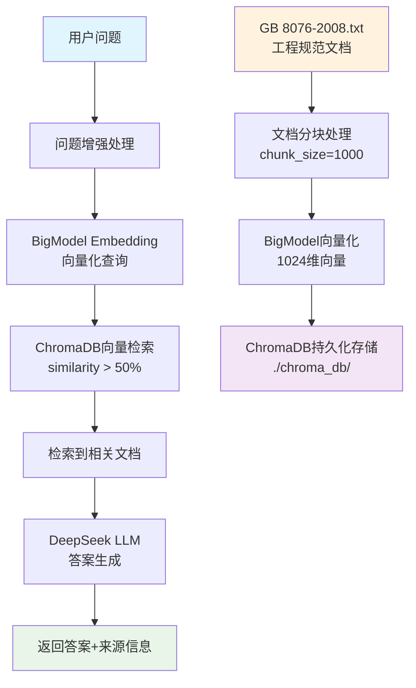

# 工程监理智能问答系统

基于向量检索和大语言模型的工程监理专业问答系统，支持中文工程规范文档的智能检索和问答。

## 🚀 系统特色

- **🎯 专业领域**: 专为工程监理领域设计，支持混凝土、钢结构、脚手架等专业问题
- **🇨🇳 中文优化**: 使用BigModel embedding-2模型，针对中文工程文档优化
- **📚 知识溯源**: 每个回答都提供详细的文档来源信息和相似度分数
- **🤖 智能整合**: 基于DeepSeek大模型生成专业、准确的工程监理答案
- **⚡ 高效检索**: 使用ChromaDB向量数据库，支持语义搜索和快速检索
- **🔄 智能回退**: 知识库无相关内容时自动基于通用知识回答
- **🌐 Web界面**: 提供友好的Web界面和完整的API接口

## 🏗️ 技术架构



### 核心技术栈

- **向量模型**: BigModel embedding-2 (1024维中文向量)
- **向量数据库**: ChromaDB (HNSW算法，SQLite后端)
- **大语言模型**: DeepSeek Chat (专业问答生成)
- **Web框架**: FastAPI (高性能API服务)
- **文档处理**: 自定义分块策略 (1000字符，200字符重叠)

## 📦 项目结构

```
工程问答Rag/
├── main.py                          # FastAPI主服务，Web界面和API接口
├── config.py                        # 项目配置文件
├── models.py                        # 数据模型定义
├── requirements.txt                 # Python依赖包
├── .env.example                     # 环境变量示例
│
├── 核心服务/
│   ├── bigmodel_embedding.py           # BigModel向量化服务
│   ├── bigmodel_embedding_function.py  # ChromaDB向量化函数
│   ├── bigmodel_knowledge_base.py      # 知识库管理器
│   ├── llm_service.py                  # DeepSeek LLM服务
│   └── document_processor.py           # 文档处理服务
│
├── 工具脚本/
│   ├── build_bigmodel_kb.py            # 知识库构建脚本
│   ├── enhanced_qa_test.py             # 增强版问答测试工具
│   ├── chromadb_simple_visualizer.py   # ChromaDB可视化工具
│   └── chromadb_visualizer.py          # 高级可视化工具
│
├── 数据/
│   ├── GB+8076-2008.txt             # 混凝土外加剂标准文档
│   ├── chroma_db/                   # ChromaDB向量数据库
│   └── logs/                        # 系统日志目录
│
└── 文档/
    ├── test_summary.md              # 系统测试报告
    └── README.md                    # 项目说明文档(本文件)
```

## 🛠️ 安装配置

### 1. 环境要求

- Python 3.8+
- 8GB+ 内存推荐
- 网络连接（用于API调用）

### 2. 安装依赖

```bash
# 克隆项目
git clone <your-repo-url>
cd 工程问答Rag

# 安装Python依赖
pip install -r requirements.txt
```

### 3. 配置API密钥

复制环境变量示例文件：
```bash
cp .env.example .env
```

编辑 `.env` 文件，配置API密钥：
```env
# DeepSeek API配置
DEEPSEEK_API_KEY=your_deepseek_api_key
DEEPSEEK_BASE_URL=https://api.deepseek.com/v1

# BigModel API配置  
BIGMODEL_API_KEY=your_bigmodel_api_key
BIGMODEL_BASE_URL=https://open.bigmodel.cn/api/paas/v4
```

或直接修改 `config.py` 中的API密钥：
```python
class Config:
    OPENAI_API_KEY = "your_deepseek_api_key"
    bigmodel_api_key = "your_bigmodel_api_key"
```

### 4. 构建知识库

```bash
# 使用GB 8076-2008标准文档构建知识库
python build_bigmodel_kb.py
```

## 🚀 使用指南

### 1. 启动Web服务

```bash
python main.py
```

服务启动后访问: http://localhost:8000

### 2. Web界面使用

- 在输入框中输入工程监理相关问题
- 系统会自动检索相关规范内容
- 显示专业答案和详细的文档来源信息
- 支持连续对话和问题追问

### 3. API接口使用

#### 问答接口
```bash
curl -X POST "http://localhost:8000/ask" \
  -H "Content-Type: application/json" \
  -d '{
    "question": "什么是外加剂？",
    "session_id": "test_session"
  }'
```

#### 知识检索接口
```bash
curl "http://localhost:8000/search?query=减水剂&top_k=5"
```

#### 系统状态接口
```bash
curl "http://localhost:8000/status"
```

### 4. 命令行测试工具

```bash
# 单问题测试
python enhanced_qa_test.py "外加剂的作用是什么？"

# 交互式测试
python enhanced_qa_test.py
# 选择模式2进行交互式测试

# 批量测试
python enhanced_qa_test.py
# 选择模式1进行批量测试
```

## 📊 数据库可视化

查看ChromaDB向量数据库状态：

```bash
# 运行可视化工具
python chromadb_simple_visualizer.py

# 查看详细统计信息
# - 数据库大小和文件结构
# - 集合统计和文档分布
# - 生成统计图表
```

## 🧪 测试验证

### 预置测试问题

系统已针对以下工程监理场景进行测试验证：

1. **外加剂基础知识**
   - "什么是外加剂？"
   - "外加剂的种类有哪些？"

2. **减水剂相关**
   - "减水剂的作用是什么？"
   - "高性能减水剂和普通减水剂的区别？"

3. **技术规范**
   - "外加剂的掺量要求是多少？"
   - "HPWR是什么意思？"

4. **施工应用**
   - "如何选择合适的外加剂？"
   - "外加剂与水泥的适应性问题如何解决？"

### 性能指标

- **检索准确率**: 相似度50%+的匹配结果
- **答案置信度**: 平均67.8%（最新测试）
- **响应时间**: 通常2-5秒
- **知识库规模**: 56个文档块，覆盖GB 8076-2008标准
- **智能回退**: 无相关文档时自动切换到通用知识模式

## 🔧 配置说明

### 主要配置项

```python
class Config:
    # API配置
    OPENAI_API_KEY = "your_deepseek_key"
    bigmodel_api_key = "your_bigmodel_key"
    
    # 检索配置
    SIMILARITY_THRESHOLD = 0.3      # 相似度阈值
    MAX_RETRIEVAL_RESULTS = 5       # 最大检索结果数
    
    # 文档处理配置
    DOCUMENT_CONFIG = {
        "chunk_size": 1000,         # 文档块大小
        "chunk_overlap": 200,       # 重叠字符数
        "max_chunks_per_document": 50
    }
    
    # ChromaDB配置
    CHROMA_PERSIST_DIRECTORY = "./chroma_db"
    
    # 服务器配置
    HOST = "0.0.0.0"
    PORT = 8000
```

### 工程领域配置

系统预置了以下工程领域的关键词和相关规范：

- **混凝土**: GB 50010, GB 50204, JGJ 55
- **钢结构**: GB 50017, GB 50205, JGJ 81  
- **脚手架**: GB 51210, JGJ 130, JGJ 162
- **地基基础**: GB 50007, GB 50202, JGJ 94
- **防水工程**: GB 50208, GB 50207, JGJ 298
- **保温工程**: GB 50176, JGJ 144, JGJ 26

## 🚨 注意事项

### API密钥安全
- 不要在代码中硬编码API密钥
- 使用环境变量或配置文件管理敏感信息
- 定期轮换API密钥

### 数据库维护
- 定期备份 `chroma_db` 目录
- 监控数据库大小和性能
- 清理无用的临时文件

### 性能优化
- 根据实际需求调整 `SIMILARITY_THRESHOLD`
- 优化文档分块大小以平衡检索效果和性能
- 监控API调用频率，避免超出限制

## 🤝 贡献指南

1. Fork 项目
2. 创建功能分支 (`git checkout -b feature/AmazingFeature`)
3. 提交更改 (`git commit -m 'Add some AmazingFeature'`)
4. 推送到分支 (`git push origin feature/AmazingFeature`)
5. 创建 Pull Request

## 📝 更新日志

### v1.0.0 (当前版本)
- ✅ 完整的问答系统架构
- ✅ BigModel + DeepSeek 技术栈
- ✅ Web界面和API接口
- ✅ ChromaDB向量数据库
- ✅ 详细的来源信息追溯
- ✅ 可视化和测试工具

## 📄 许可证

本项目采用 MIT 许可证 - 查看 [LICENSE](LICENSE) 文件了解详情

## 🙏 致谢

- [BigModel](https://open.bigmodel.cn/) - 提供中文向量化服务
- [DeepSeek](https://www.deepseek.com/) - 提供大语言模型服务  
- [ChromaDB](https://www.trychroma.com/) - 提供向量数据库技术
- [FastAPI](https://fastapi.tiangolo.com/) - 提供Web框架支持

---

**如有问题或建议，请提交 Issue 或联系项目维护者。** 